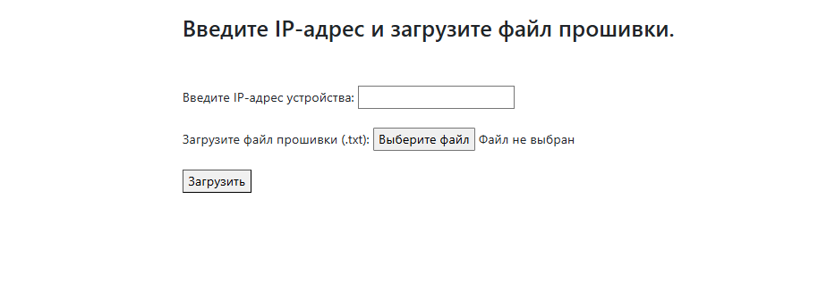
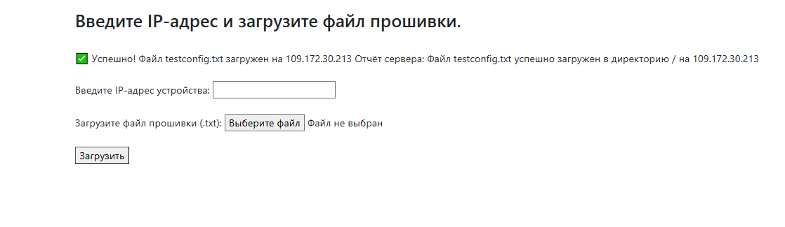
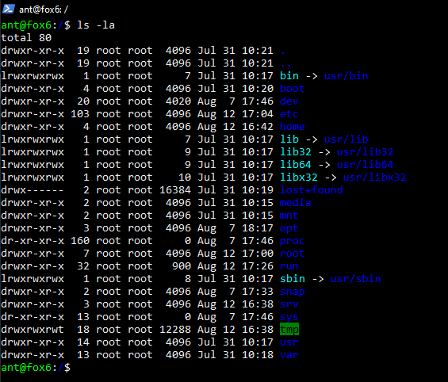
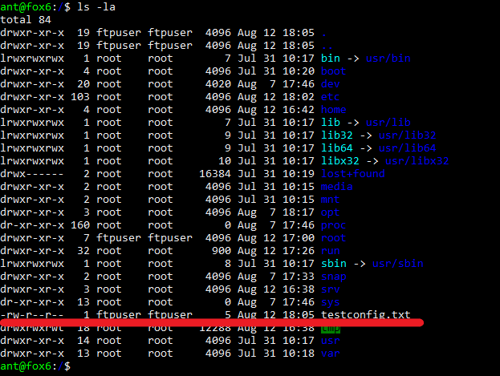

### Веб сервис для загрузки прошивок на оборудование по ftp ###

Для запуска - склонируйте проект командой git clone https://github.com/ant4p/input_ip_and_upload_file_to_ftp.git   
Создайте виртуальное окружение. 
Установите в виртуальное окружение файл requirements.txt командой pip install -r requirements.txt 
Файл .env_example замените на .env c вашими данными:  
SECRET_KEY - ваш секретный ключ от django 
PORT - порт для подключения к FTP серверу 
USER - пользователь с правами доступа для записи в каталог "/" 
(ОБЯЗАТЕЛЬНО! Проверяйте права доступа пользователя для записи в корневой каталог, т.к. по умолчанию их нет) 
USER_PASSWORD - пароль от пользователя 
Для минимально рабочего функционала - этого будет достаточно. 
В корневой папке проекта осуществите миграции командой python manage.py migrate 
Запустите проект на локальном сервере командой python manage.py runserver 
При переходе на http://127.0.0.1:8000 будет доступна страница: 
 

 

 
Введите данные IP-адреса устройства, и загрузите файл конфигурации 
(в данном варианте это .txt файл) 
При правильном вводе данных IP-адреса, а так-же размера и формата загружаемого файла -  вы получите:
 

 

При вводе неправильных данных - форма провалидирует данные и выдаст всплывающие подсказки. 
 
Для проверки в корневом каталоге вашего FTP cервера - появится загружаемый файл. 

 

 

 

 
Веб сервис подготовлен для деплоя на сервер с помощью Docker и Docker compose. 
Для этого понадобится VPS c установленными Docker и Docker compose, и минимально настроенными политиками безопасности. 
Для запуска - склонируйте проект командой git clone https://github.com/ant4p/input_ip_and_upload_file_to_ftp.git 
Файл .env_example замените на .env c вашими данными:  
SECRET_KEY - ваш секретный ключ от django 
PORT - порт для подключения к FTP серверу 
USER - пользователь с правами доступа для записи в каталог "/" 
USER_PASSWORD - пароль от пользователя :
POSTGRES_HOST, POSTGRES_PORT, POSTGRES_DB, POSTGRES_USER, POSTGRES_PASSWORD - данные для БД PostgreSQL 
ALLOWED_HOST, SCRF_SUBDOMAIN=*. - доменное имя 

Перейдите в папку с проектом и запустите docker-compose.yml файл командой: docker compose up  
После того, как проект сбилдится и запустится -  
перейдите по адресу доменного имени, он будет доступен по протоколу https 

Для веб сервиса использованы: 
Локальный запуск: 
python3.12 - ЯП 
pip -пакетный менеджер 
python venv - в качестве виртуального окружения 
Django 5.2.5 - основа 
python-dotenv переменные окружения .env 
ftplib - для взаимодействия с FTP 
sqlite3 - в качестве стандартной БД для django 
 
На сервере + : 
Docker compose - для финальной сборки  
Docker - для сборки образов  
PostgreSQL - в качестве БД  
NGINX - в качестве веб сервера  
acme-companion - для получения бесплатных ssl сертификатов  

